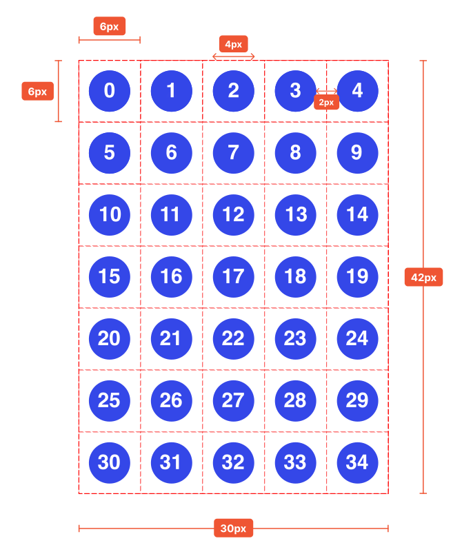

# Led Board

Aug 2023

[View demo](https://massimo-cassandro.github.io/area-test/2023-08-led-board/build/index.html)

## Scheme

 
 
 
 
 
 
 
 
 

## Refs
* <https://stackoverflow.com/a/61964526/743443>
* <https://developer.mozilla.org/en-US/docs/Web/SVG/Tutorial/Getting_Started#basic_properties_of_svg_files>
* <https://developer.mozilla.org/en-US/docs/Web/SVG/Element/script>
* <https://dev.w3.org/SVG/modules/ref/master/SVGRefPrimer.html>
